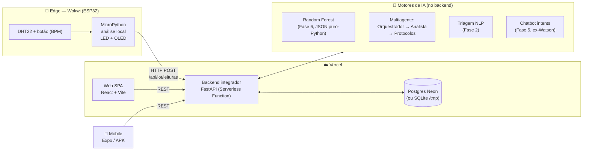

# 🫀 CardioIA — Fase 7: Coração Sob Controle

> **MVP final da plataforma CardioIA** — integração de todos os módulos das fases 1–6
> em um ecossistema único: backend Python, web React+Vite, mobile Expo e sensor
> ESP32 em MicroPython. Projeto acadêmico FIAP (PBL), uso educacional.

## 👥 Integrantes

| Nome | RM |
|------|----|
| _preencher_ | RM560639 |
| _preencher_ | RM559625 |
| _preencher_ | RM559923 |
| _preencher_ | _RM_ |

## 🔗 URLs da entrega

| Item | URL |
|------|-----|
| 🌐 Web (Vercel) | <https://cardio-ia-7-web.vercel.app> |
| ⚙️ API (Vercel) | <https://cardio-ia-7-backend.vercel.app/api/health> |
| 📱 Build APK (Expo/EAS) | <https://expo.dev/accounts/tiagomartins-s/projects/cardio-ia-7/builds/c462beab-95d8-4973-8fa4-aaf1a2fdc359> |
| 📡 Simulação Wokwi (MicroPython) | <https://wokwi.com/projects/466491403812407297> |
| 🎬 Vídeo demonstrativo | `https://PREENCHER` |

> ⚠️ Os placeholders acima são substituídos após os deploys — passo a passo completo em [TAREFAS-HUMANAS.md](TAREFAS-HUMANAS.md).

## 🏗️ Arquitetura



Fluxo exigido na atividade: **Sensor → MicroPython → Backend Python → APIs de IA → UI** ✅

### Decisão de arquitetura: 100% Vercel

A atividade sugeria Vercel/Render/Netlify etc. **Optamos por concentrar todo o deploy na Vercel** (web + backend), pelo CI/CD unificado por push no GitHub. Consequências técnicas (detalhadas no [relatório](docs/relatorio-tecnico.md)):

1. **Backend como Serverless Function Python** — o FastAPI é exposto via `backend/api/index.py` + rewrite no `vercel.json`.
2. **ML sem scikit-learn em produção** — a Random Forest da Fase 6 foi **exportada para JSON** (`ml/export_model.py`) e a inferência é Python puro (paridade verificada: delta < 1e-9 vs `predict_proba`). Isso reduz a function de >150 MB para poucos MB. O mesmo vale para o classificador NLP da Fase 2 (TF-IDF + LogReg exportados).
3. **Banco com driver duplo** — Postgres gerenciado (Vercel Marketplace/Neon) quando `POSTGRES_URL` existir; senão SQLite (local em dev, `/tmp` na Vercel com seed automático).

## 📁 Estrutura

```
cardio-ia-7/
├── backend/          # FastAPI integrador (fases 2+3+5+6) + api/index.py p/ Vercel
│   ├── app/          # endpoints, agentes, serviços ML/NLP/IoT, dados exportados
│   └── tests/        # smoke tests (pytest) — 7 testes
├── web/              # React + Vite SPA (vercel.json com rewrite SPA)
├── mobile/           # React Native + Expo (app.json + eas.json perfil preview → APK)
├── iot/              # MicroPython p/ Wokwi (main.py, diagram.json, ssd1306.py)
├── ml/               # modelo da Fase 6 + export_model.py (joblib → JSON)
└── docs/             # relatório técnico (PDF), roteiro do vídeo, prints
```

## 🚀 Como executar localmente

### Backend (Python 3.11+)

```bash
python -m venv .venv
.venv\Scripts\activate            # Windows
pip install -r backend/requirements-dev.txt
cd backend
python -m uvicorn app.main:app --port 8765
```

API em `http://127.0.0.1:8765` (Swagger em `/docs`). O banco SQLite é criado e
populado automaticamente no primeiro boot.

```bash
# rodar os testes
cd backend && python -m pytest tests -q   # 7 passed
```

### Web

```bash
cd web
npm install
npm run dev          # http://localhost:5173 (usa VITE_API_URL ou localhost:8765)
```

### Mobile

```bash
cd mobile
npm install
npx expo start       # abrir no Expo Go (defina EXPO_PUBLIC_API_URL se necessário)
```

### IoT (Wokwi)

Ver [iot/README.md](iot/README.md) — colar `main.py`, `diagram.json` e `ssd1306.py`
num projeto *MicroPython on ESP32* e ajustar `API_URL`.

## ☁️ Deploy (CI/CD)

Dois projetos Vercel apontando para o mesmo repositório GitHub — cada push na
branch `main` dispara deploy automático de ambos:

| Projeto | Root Directory | Observações |
|---|---|---|
| `cardio-ia-7-web` | `web/` | `vercel.json` já configura rotas SPA; definir env `VITE_API_URL` |
| `cardio-ia-7-backend` | `backend/` | function Python; opcional: adicionar Postgres (Marketplace → Neon) |

Mobile: `eas build -p android --profile preview` gera o `.apk` na nuvem do Expo
(perfil já configurado em `mobile/eas.json`).

## 🔌 Endpoints principais

| Método | Rota | Origem |
|--------|------|--------|
| GET | `/api/health` | status geral (banco, modelo, NLP) |
| POST | `/api/predicoes` | pipeline multiagente + Random Forest (Fase 6) |
| POST | `/api/triagem-nlp` | ontologia + risco textual (Fase 2) |
| POST | `/api/iot/leituras` | ingestão do sensor MicroPython (Fase 3→7) |
| GET | `/api/iot/leituras` | leituras para dashboards (web/mobile) |
| POST | `/api/chat` | chatbot por intents (Fase 5) com handoff à triagem |
| GET/POST/DELETE | `/api/pacientes` | CRUD de pacientes |
| GET | `/api/protocolos` · `/api/modelo/metrics` | base clínica e métricas do modelo |

## 📸 Prints do deploy

> _Adicionar em `docs/prints/` após os deploys (ver TAREFAS-HUMANAS.md):_
> deploy Vercel concluído (web e backend), build EAS com QR Code, app instalado
> no dispositivo, simulação Wokwi rodando.

## 🧬 O que veio de cada fase

| Fase | Reaproveitamento na Fase 7 |
|------|---------------------------|
| 1 — Batimentos de Dados | Variáveis clínicas que definem o schema de sinais vitais |
| 2 — Diagnóstico Automatizado | `nlp_service.py`: ontologia (22 regras) + classificador TF-IDF/LogReg exportado |
| 3 — IoT | Lógica de sensores convertida C/C++ → MicroPython (`iot/main.py`), com buffer offline |
| 4 — Visão Computacional | Citada na arquitetura como extensão (análise de ECG por imagem) |
| 5 — Chatbot Watson | Intents e respostas reimplementadas como NLU local em `chat_agent.py` |
| 6 — Multiagente preditivo | Backend FastAPI, Random Forest, agentes e protocolos — núcleo da plataforma |

## 📄 Documentos

- [docs/relatorio-tecnico.md](docs/relatorio-tecnico.md) / `docs/relatorio-tecnico.pdf` — relatório (≤5 páginas) com diagrama de arquitetura
- [docs/script-video.md](docs/script-video.md) — roteiro do vídeo (≤5 min)
- [TAREFAS-HUMANAS.md](TAREFAS-HUMANAS.md) — checklist do que falta fazer manualmente

---

⚠️ **Aviso**: sistema educacional. Não realiza diagnóstico médico real e não
substitui avaliação profissional. Em emergência, ligue **192 (SAMU)**.
